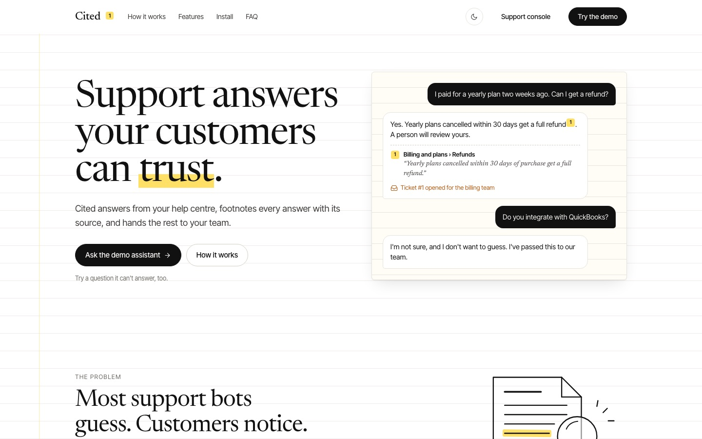
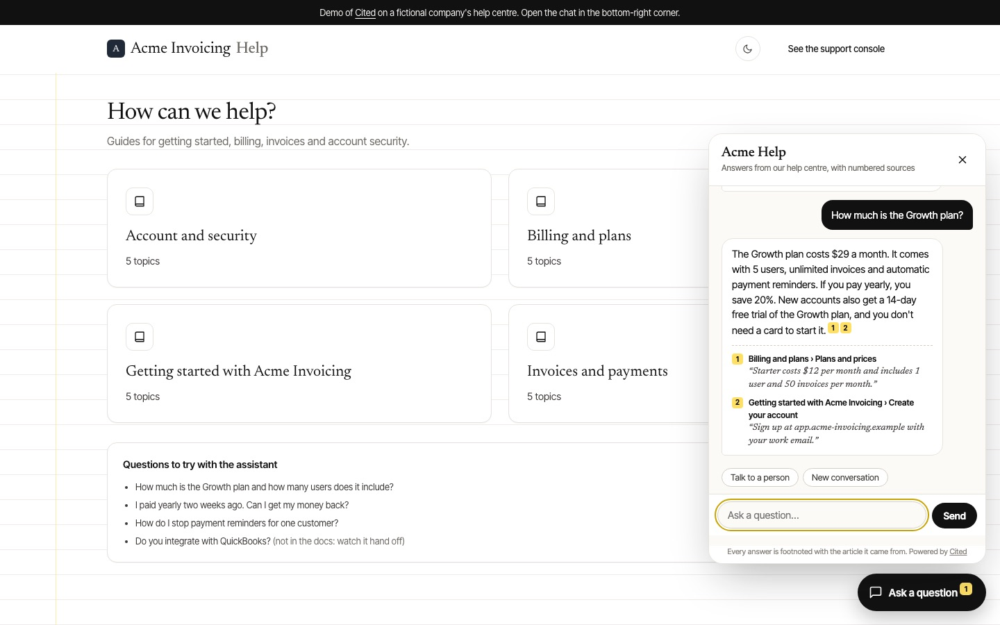
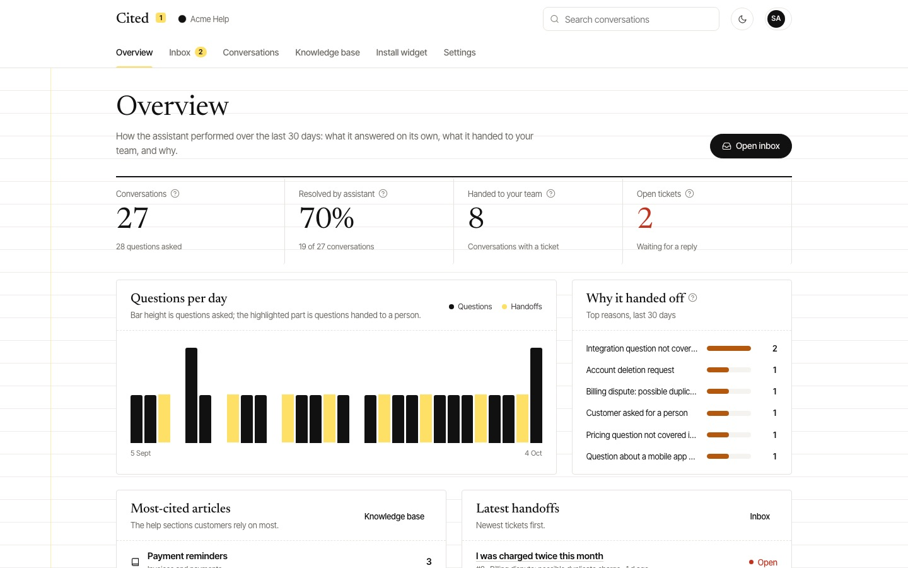
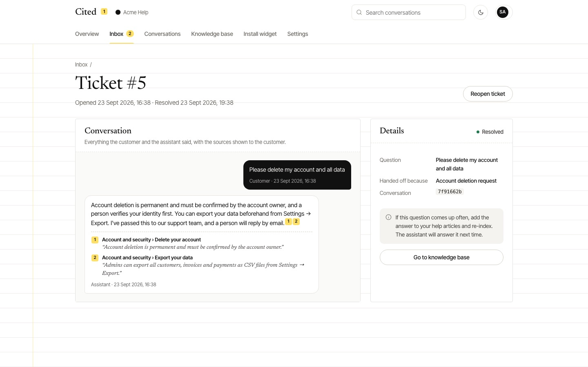
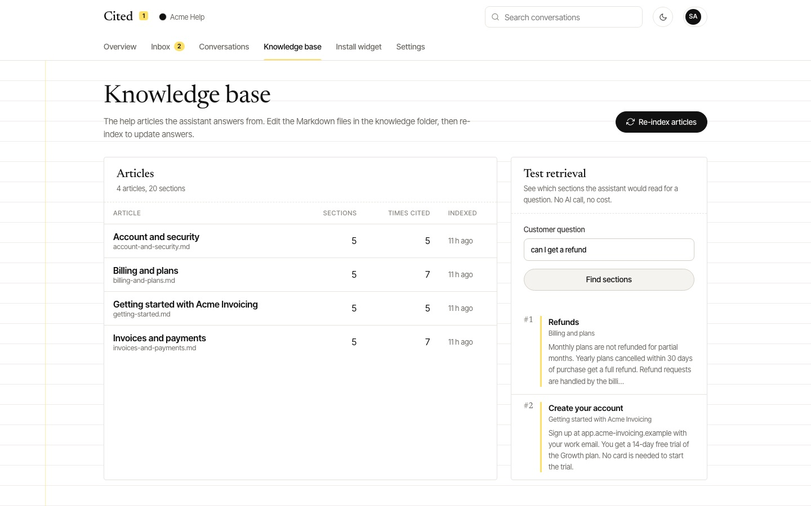

# Cited: AI support answers your customers can trust

Cited is an AI help desk that answers customer questions **only from a company's own help articles**, footnotes every
answer with the article it came from, and hands anything it can't answer to the support team with the full
conversation attached.



**Built by [Sydney Torkornoo](https://baobabpeaks.com)**, full-stack and AI developer · [GitHub](https://github.com/sydneyKojo)

**Live demo: [cited.baobabpeaks.com](https://cited.baobabpeaks.com)**. Try the assistant on the [demo help centre](https://cited.baobabpeaks.com/demo).

---

## The problem it solves

Most support chatbots guess. A confident wrong answer about pricing or refunds costs more than no answer at all, and
nobody can tell where an answer came from. Cited is built to be right or to step aside:

- **Every answer shows its sources:** numbered footnotes with a quoted excerpt from the help article.
- **It doesn't guess:** if the docs don't cover a question, it says so and opens a ticket.
- **Handoffs arrive with context:** the team sees the question, why it was handed off and the whole transcript.
- **Docs stay the source of truth:** edit an article, re-index, and answers change. There's no training step.

**Who it's for:** SaaS and e-commerce support teams, IT and internal helpdesks, and small teams without 24/7 cover.

## Screenshots

| The chat widget on a help centre | Support console overview |
|---|---|
|  |  |
| **A handed-off ticket with transcript** | **Knowledge base with retrieval tester** |
|  |  |

## How an answer is made

```
Customer question (widget: one <script> tag on any allowed website)
  → asks for a person?          → ticket for the team, no AI call
  → search the help articles     PostgreSQL full-text search over article sections (headings weighted higher),
                                 including the previous question so follow-ups still match
  → nothing relevant?            → "I don't want to guess" + ticket
  → Claude drafts a reply        structured output: answer, cited section ids, needs_human, reason
  → code checks the citations    no citation, or a section it wasn't shown → answer hidden, ticket opened
  → answer + footnotes           [1] Billing and plans › Refunds  “Yearly plans cancelled within 30 days…”
```

The final check runs in code, not in the prompt: an answer that isn't grounded in a real, retrieved section never
reaches the customer.

## Features

### Chat widget
- One `<script>` tag; isolated with Shadow DOM so it never clashes with the host site's styles.
- Uses the configured assistant name, greeting and brand colour; follows the host page's light/dark theme.
- Numbered footnotes with quoted excerpts, "Talk to a person" and "New conversation" shortcuts, typing indicator,
  keyboard accessible, clear messages for rate limits and outages.

### Support console (`/console`)
- **Overview:** conversations, share resolved by the assistant, handoffs, open tickets, questions per day, top handoff
  reasons, most-cited articles.
- **Inbox:** open and resolved tickets with search; each ticket shows the transcript and the sources the customer saw;
  resolve (with confirmation) or reopen.
- **Conversations:** every chat, filtered by outcome, searchable by message text.
- **Knowledge base:** articles with section and citation counts, one-click re-index, and a **retrieval tester** that
  shows which sections would be used for any question (no AI cost).
- **Install:** embed snippet with copy button. **Settings:** assistant name, greeting, brand colour, allowed websites.

### Public pages
- Product homepage, plus a demo help centre for a fictional company ("Acme Invoicing") rendered from the same
  knowledge base, with the live widget.

## Production hardening

- **Allowed websites only:** the chat API serves listed origins (CORS) *and* refuses other origins server-side before
  any AI call, so other sites can't spend your AI budget.
- **Rate limiting:** 20 messages per visitor per 5 minutes.
- **Console access:** an admin token is exchanged for a signed, expiring, httpOnly session cookie (constant-time
  checks; rotating the token signs everyone out).
- **Refusal handling** and server-side model fallback on the Claude API.

## Tech stack

TypeScript · Node.js · Hono (server-rendered JSX) · PostgreSQL full-text search · Claude API (Claude Opus 5.5,
structured outputs) · Zod · Vitest · vanilla JavaScript widget · hand-written CSS (Newsreader and Inter Tight, light
and dark themes).

## Run it locally

Requires Node 22+ and PostgreSQL.

```bash
npm install
cp .env.example .env        # set ADMIN_TOKEN and ANTHROPIC_API_KEY (or LLM_PROVIDER=claude-code to use a local Claude login)
createdb helpdesk && createdb helpdesk_test
npm run seed                # loads knowledge/*.md and a month of example conversations (no AI calls)
npm run dev                 # http://localhost:3300 · demo: /demo · console: /console
npm test                    # 27 tests: retrieval, grounding rules, handoffs, CORS, rate limits, console auth
npm run ask -- "How do I reset my password?"
```

Embed on any allowed site: `<script src="https://your-cited-host/widget.js" defer></script>`

## Project structure

```
src/app.tsx          routes: public site, widget API, console, bearer-token API
src/assistant.ts     the answer pipeline and grounding check
src/knowledge.ts     Markdown chunking, ingest, full-text search
src/llm.ts           Claude API (and local Claude Code) answerers, prompt, schema
src/insights.ts      console analytics, inbox, conversations, articles
src/views/           server-rendered pages (site and console)
public/widget.js     the embeddable chat widget
knowledge/           the sample help articles
```

## Deployment notes

Runs as one long-lived Node service with PostgreSQL (Railway, Render or Fly.io). Set `ANTHROPIC_API_KEY`,
`ADMIN_TOKEN` and the allowed websites in Settings, and set a monthly spend limit in the Anthropic console.

---

The sample company "Acme Invoicing" and its articles are fictional.

© 2026 Sydney Torkornoo. All rights reserved. This code is published for portfolio review; it is not licensed for
reuse. For work enquiries, visit [baobabpeaks.com](https://baobabpeaks.com).
